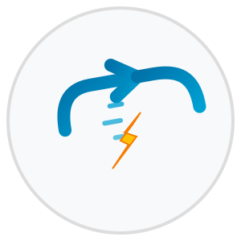
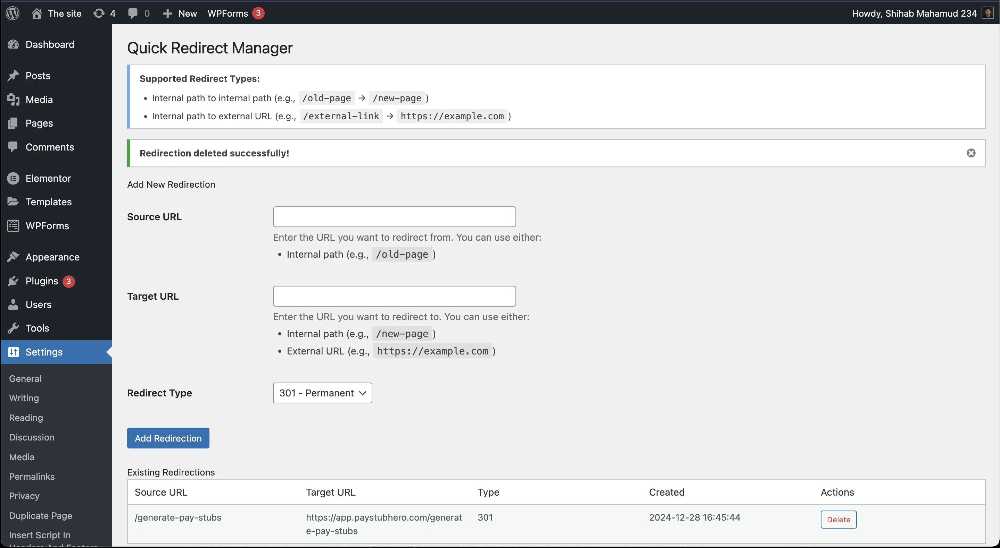

# Quick Redirect Manager

<p align="center">
  
</p>

A lightweight WordPress URL redirection manager that uses WordPress's native options table for storage. Perfect for managing redirects without the overhead of additional database tables.

## 🚀 Features

- Simple and intuitive WordPress admin interface
- Support for both 301 (permanent) and 302 (temporary) redirects
- Multiple redirection types:
    - Internal path to internal path (`/old-page` → `/new-page`)
    - Internal path to external URL (`/external-link` → `https://example.com`)
- Lightweight - uses WordPress options table (no additional tables)
- Built with performance in mind

## Dashboard



## 📋 Requirements

- PHP 8.0 or higher
- WordPress 5.0 or higher

## 🔧 Usage

1. Go to Settings → Redirections in your WordPress admin
2. Add a new redirection:
    - Enter source URL (redirect from)
    - Enter target URL (redirect to)
    - Select redirect type (301 or 302)
    - Click "Add Redirection"

## 💻 Development

### Setup

```bash
# Clone the repository
git clone https://github.com/p-nerd/quick-redirect-manager.git

# Install dependencies
composer install
```

## 📝 License

Licensed under the GPL v2 or later - see the [LICENSE](LICENSE) file for details.

## 👤 Author

**Shihab Mahamud**

- Email: shihab4t@gmail.com
- GitHub: [@p-nerd](https://github.com/p-nerd)
